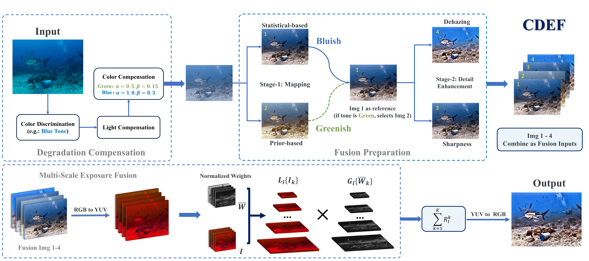

# [JOE 2025] Underwater Scene Enhancement via Adaptive Color Analysis and Multi-Space Fusion

This repository contains the MATLAB implementation of CDEF (MATLAB Version) underwater image enhancement algorithm described in [JOE 2025]().

[](https://bilityniu.github.io/CDEF/)
[](https://doi.org/xxx)
[](https://www.apache.org/licenses/LICENSE-2.0)

## 🌊 Overview

Our method takes into account different types of underwater scenes and employs two-type enhancements based on bluish and greenish images. By performing two color space conversions, we significantly increase the color correlation between the RGB channels and reduce color deviation during the processing stage. The raw images are compensated for the lost color channel information while mapping the image tone and remaining detail by dehazing and sharpening. The multi-scale exposure pyramids in YUV space are adopted to fuse these enhanced images as inputs. The specific weights can guide these inputs to preserve proper brightness and details with low color distortion and artifacts.



## 🪸 Requirements

- MATLAB R2018b or later
- Image Processing Toolbox

## 🐬 Usage

```matlab
% Process multiple images in a directory
input_dir = './Images/';
output_dir = './Results/';
% Run demo_img.m to process all images in the input directory
```

## 🐚  Method Pipeline

1. **Degradation Compensation**: Color and light correction
2. **Fusion Preparation**: Statistical and prior-based mapping, detail enhancement
3. **Multi-Scale Exposure Fusion**: Multi-scale pyramid fusion in YUV space
4. **CDEF**: Color-space based decision fusion

## 🐢 Project Structure

```
./
├── demo_img.m             # Main script
├── lib/                   # Core algorithms
├── EF/                    # Fusion algorithms  
├── IDE/                   # Dehazing module
├── images/                # Input images
└── results/               # Output images
```

## 📖 Citation

If you use this code in your research, please cite:

```
@article{cdef_2025_JOE,
    title={Underwater Scene Enhancement via Adaptive Color Analysis and Multi-Space Fusion},
    author={Yuan, Jieyu and Zhang, Yuhan and Cai, Zhanchuan},
    journal={IEEE Journal of Oceanic Engineering},
    doi={10.1109/JOE.2025.3591405},
    year={2025}
}
```

## 🏖️Contact

For questions and further information, please contact: jieyuyuan.cn@gmail.com

